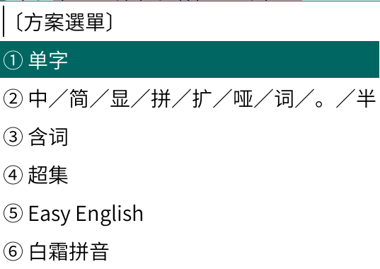

## 缘起

98五笔输入主页：http://www.98wubi.com

五笔输入：https://github.com/yanhuacuo/weasel-data

拼音输入：[https://github.com/iDvel/rime-ice](https://github.com/iDvel/rime-ice)

英文输入：https://github.com/BlindingDark/rime-easy-en


## 简介

包含 98 五笔中州韵版：

- 单字输入
- 含词输入
- 超集输入「含Unicode15.1全部汉字」

另外，将雾凇拼音作为五笔输入的拼音反查方案

另外，加入Easy English方案作为五笔中英混输的英文方案




## 修改说明

为适配中英混输，做了如下修改：

1. 将`拼音反查`改为两次`zz`键

1. 在`拼音反查`功能中加入模糊音

1. `金额转换｜农历公历互转换` 改为两次`ZZ`键

2. `单字过滤`开启时不过滤英文

4. 中文「单字」下，对英文的输入做了限制：只有在码长大于等于4时才会进入英文的输入匹配

   在码长为1、2、3时不会匹配英文，而码长为4时，五笔汉字的编码能与英文重合的较少

   能极大缓解中英混合输入时对候选框的干扰

3. 为方便出错回改，左右选择方向键恢复左右选择功能

4. 在中文「单字」下，【仅对`wubi98_dz`有效】

   当输入的字符串：**即没中文匹配又没英文匹配时**，将返回两个候选项：

   
   
   1. 在键盘上直接输入的字母
   2. 对键盘上输入的字母进行单词拆分 「即英文的连续输入增强功能」
   
8. 英文输入：增加希腊大小写、数学常用符号输入「跟LaTeX中各符号输入相同」

8. 将拼音反查方案改为雾凇拼音

8. 修改「单字」码表

   1. 增加常用三码位（添加在`wubi98_dz.dict.yaml`最未尾）

      ```
      该	yyn	327955	yynw
      幺	xxx	329488	xxxx
      文	yyg	327975	yygy
      礼	pyn	343353	pynn
      作	wth	331337	wth
      ```
      
      纯中文输入，三码显的不太重要，但对于中英混输，关闭了四码上屏和顶格上屏，这时三码的作用就显示出来了。以上仅是个人习贯，各位不用的，直接删去就行
   


## 使用环境

- 系统：Debian 12
- 桌面：kde
- 输入法：Fcitx5-Rime


